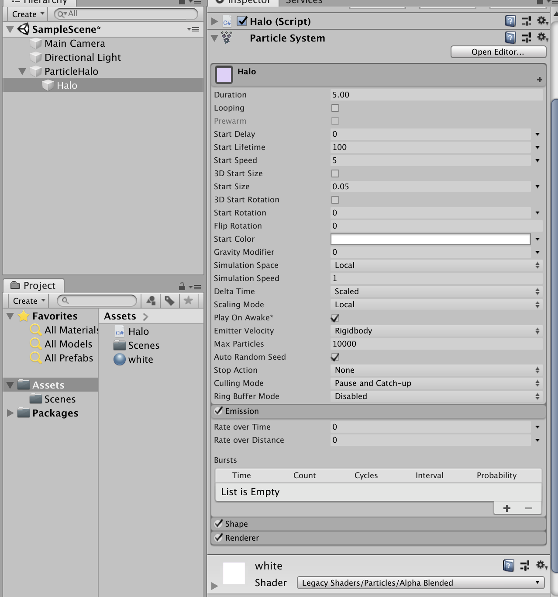
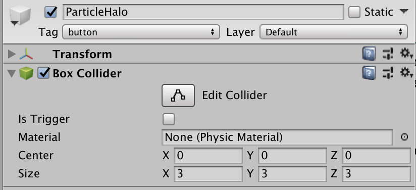
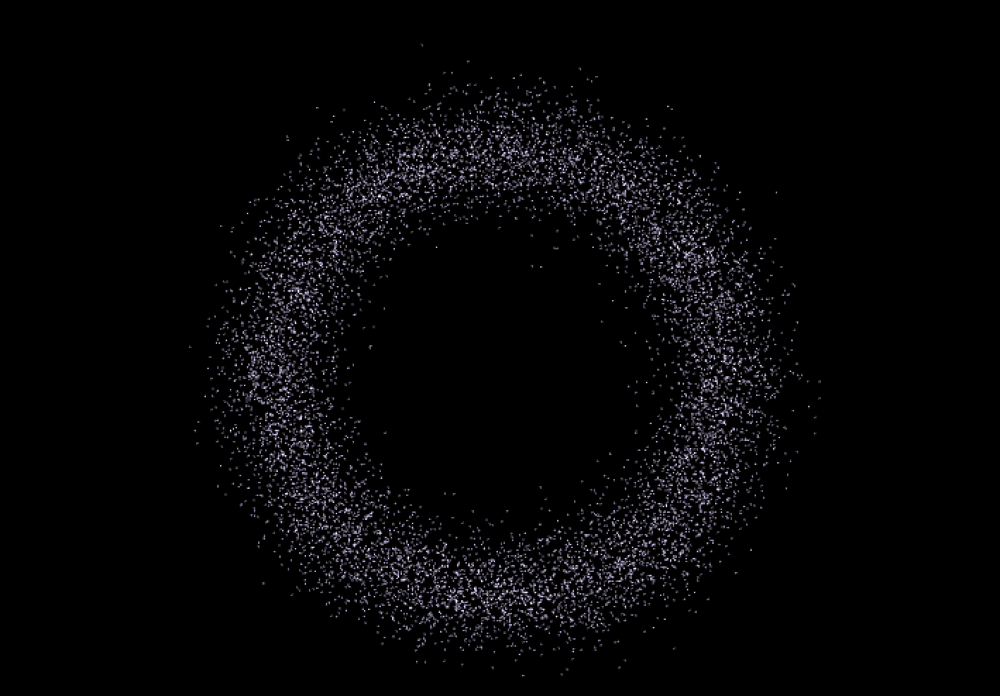

#### 粒子光环

- 设计说明
  - 粒子沿着圆环以不同方向做运动
  - 当鼠标移到圆环中心，圆环收缩，移开时圆环恢复。

#### 粒子的创建

创建一个空项目，添加Particle System的组件，并给它挂上材料，调节参数，粒子系统就可以生成粒子了。



因为之后涉及到检测光标的位置，所以要给光环上增加检测器。并将它的tag设为button。



#### 粒子的正态分布

因为希望粒子光环最内和最外粒子少，中间粒子多。所以要生成服从正态分布的随机数。先找到均匀随机分配的随机数，再获得服从正态分布的随机数。

```c#
class Ndistribution{
    System.Random rand = new System.Random();
    public double getNormalDistribution(double mean, double stdDev)
    {
        double u1 = 1.0 - rand.NextDouble(); //uniform(0,1] random doubles
        double u2 = 1.0 - rand.NextDouble();//两个独立的均匀随机数
        double randStdNormal = Math.Sqrt(-2.0 * Math.Log(u1)) *
                     Math.Sin(2.0 * Math.PI * u2); //random normal(0,1)
        double randNormal = mean + stdDev * randStdNormal; //random normal(mean,stdDev^2)
        return randNormal;
    }
}
```

这个算法方法简单，但是原理似乎很复杂，我没有深入研究。

#### 粒子的运动

##### 粒子数据结构

首先创建粒子数组和它的数据数组来存储粒子的信息。包括它的角度，半径，以及收缩前后的半径。（都是对于原点来说）

```c#
public ParticleData(float angle, float radius, float before, float after) {
    this.angle = angle;
    this.radius = radius;
    this.before = before;
    this.after = after;
}
public int particleNum = 10000; // 粒子数目
private ParticleSystem.Particle[] particles;//粒子数组
private ParticleData[] particleDatas;//粒子data
```

##### 粒子数据初始化

粒子的半径，角度都是随机生成的。before即初始半径，after为收缩后的半径。因为收缩后应该是内部比较紧凑，外部松散，所以after比阈值小的粒子会有另外的值。依然使用随机数得到after，这样得到的数据看起来连贯性比较好，粒子不会出现明显分层。

```c#
for (int i = 0; i < particleNum; i++) {
		float angle = UnityEngine.Random.Range(0.0f, 360.0f);
    float radius = (float)nd.getNormalDistribution((minRadius+maxRadius)*0.5f, 1);
    float before = radius;
    float after = 0.7f * radius;

    if (after < minRadius * 1.1f) {
    		float midRadius = minRadius * 1.2f;
        after = UnityEngine.Random.Range(UnityEngine.Random.Range(minRadius, midRadius), (minRadius * 1.1f));
    }
    particleDatas[i] = new ParticleData(angle,radius,before,after);
}
```

 ##### 粒子的收缩和扩张

收缩和扩张的时候，都以比较平和的方式来变化。当检测到鼠标移到光环中间时，就将isshrink设为true。

```c#
if (isshrink) {
    // 开始收缩
		if(particleDatas[i].radius > particleDatas[i].after) {
    		particleDatas[i].radius -= shrinkSpeed * (particleDatas[i].radius / particleDatas[i].after) * Time.deltaTime;//逼近
    }
} else {
  // 开始还原
    if (particleDatas[i].radius < particleDatas[i].before) {
    		particleDatas[i].radius += shrinkSpeed * (particleDatas[i].before / particleDatas[i].radius) * Time.deltaTime;
    } else {
        particleDatas[i].radius = particleDatas[i].before;
    }
}
ray = camera.ScreenPointToRay(Input.mousePosition);  
if (Physics.Raycast(ray, out hit) && hit.collider.gameObject.tag == "button") 
  	isshrink = true;  
else isshrink = false; 
```

##### 粒子的旋转

粒子往不同方向旋转效果会比较好。可以直接通过奇偶来判断顺时针或逆时针，不需要分两个光环来写。设置speedLevel是为了让粒子以不同速度来旋转。

```c#
if (i % 2 == 0) {  
   // 逆时针
		particleDatas[i].angle += (i % speedLevel + 1) * particleSpeed;  
} else {  
   // 顺时针
    particleDatas[i].angle -= (i % speedLevel + 1) * particleSpeed;  
}
particleDatas[i].angle = particleDatas[i].angle % 360;
```

##### 粒子数据更新

上面对粒子的半径和角度进行了更新，要将它应用到粒子上。

```c#
float rad = particleDatas[i].angle / 180 * Mathf.PI;  
// 更新粒子坐标
particles[i].position = new Vector3(particleDatas[i].radius * Mathf.Cos(rad), particleDatas[i].radius * Mathf.Sin(rad), 0f); 

particleSystem.SetParticles(particles, particleNum); //应用到粒子上
```

---

至此完成了整个项目，粒子光环做出来效果真的很漂亮。



[参考博客](https://blog.csdn.net/bkjs626/article/details/80499084) [参考博客2](https://xwy27.github.io/Unity-3d/particleRing/)

[项目仓库](https://github.com/anjahappy/3DGameHomework8)

[视频链接](https://v.qq.com/x/page/z3015kkgdv3.html)